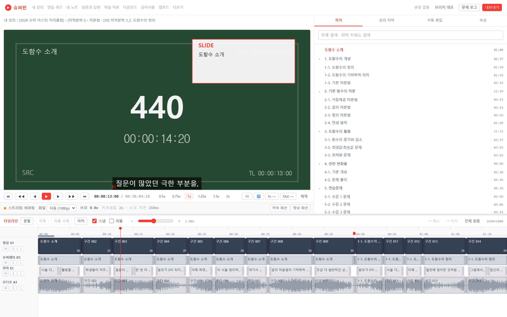

# 슈퍼런 타임라인 기반 자동 편집 · 뷰어 (MVP)

슈퍼런 AI 영상 플레이어를 위한 **타임라인 기반 자동 편집기 · 프레임 단위 뷰어 · 다중 트랙 프리뷰** 와이어프레임 MVP.



> 목업 전용입니다. DB 와 서버가 없고 외부 API 를 호출하지 않습니다. 모든 데이터는 `public/fixtures` 의 JSON 과 런타임 합성 소스에서 옵니다.

## 실행

```bash
npm install
npm run gen:fixtures   # 목업 강의 메타데이터 생성 (시드 고정, 재실행해도 동일)
npm run dev            # http://localhost:5173
```

## 검사

```bash
npm run lint
npm run test:run       # 엔진 유닛 · 속성 테스트
npm run test:cov       # src/engine 커버리지 (임계 80%)
npm run build
npm run test:e2e       # Playwright 스모크
```

## 개발 환경 주의 (Windows, 경로에 한글이 있는 경우)

이 프로젝트를 개발한 PC 에서 **Node 24.13.0 은 경로에 한글이 들어 있으면 파일 · 디렉터리 삭제가
프로세스째 죽는다**(Windows 예외 코드 `0xC0000409`). `d:\tmp\한글only` 로 재현되고
같은 위치의 ASCII 경로는 정상이다.

영향과 대응

- `vite build` 가 기존 `dist` 를 비우다가 죽고 **낡은 번들이 그대로 남는다**. 셸에서 출력을
  파이프로 넘기면 종료 코드가 가려져 빌드가 성공한 것처럼 보인다.
- 그래서 `build` 는 `prebuild` 단계에서 OS 의 `rmdir` 로 `dist` 를 지우고(`scripts/prebuild-clean.mjs`),
  vite 의 `emptyOutDir` 은 꺼 두었다. 빌드 후 `scripts/verify-build.mjs` 가 산출물이 이번 실행에서
  새로 만들어졌는지 확인한다.
- 다른 Node 도구(next, jest 등)도 같은 폴더에서 같은 증상을 낼 수 있다. Node 를 최신 LTS 로
  올리거나 작업 경로를 ASCII 로 옮기면 근본적으로 해결된다.

## 구조

```
src/engine/     React · DOM 비의존 순수 엔진 (시간은 정수 프레임)
  timebase/     Fps, sec<->frame, 타임코드
  metadata/     메타데이터 스키마 · 분석 목업 · 파형 생성
  autoedit/     경계 식별 -> 발화 구간 -> 세그먼트 -> 스코어 -> 프리셋 -> 배치
  timeline/     문서 모델 · 편집 명령 · Undo/Redo · 유효성 · 질의
  playback/     MasterClock · SyncEngine · 소스 어댑터 · 스트리밍 목업
  render/       렌더 그래프 · Canvas 합성 · 오디오 믹서 · 내보내기 잡
  errors/       오류 코드 · 복구 정책 · ErrorBus
  api/          서비스 인터페이스 · Mock 어댑터 · 브리지
src/ui/         React 화면 (엔진을 호출만 한다)
src/mock/       fixture 생성기 · 시드 난수
```

기획 문서는 저장소 상위의 `docs/` 에 있습니다. 읽는 순서는 `docs/00_INDEX.md`.

## 배포 (Cloudflare Pages)

| 항목 | 값 |
|---|---|
| 빌드 명령 | `npm run build` |
| 출력 디렉터리 | `dist` |
| Node 버전 | 20 이상 |
| SPA 폴백 | `public/_redirects` 의 `/*  /index.html  200` |

환경 변수는 없습니다.

## 자동 편집 프리셋

| 프리셋 | 동작 |
|---|---|
| 무음 제거 | 유효 무음을 제거하고 나머지를 갭 없이 이어 붙인다 |
| 챕터별 컷 | 말단 챕터마다 하나의 연속 클립을 만들고 앞뒤 무음만 잘라낸다 |
| 하이라이트 추출 | 점수 상위 구간을 목표 길이까지 채운 뒤 시간순으로 배치한다 |
| 선택 영역으로 생성 | 강의 자막에서 고른 구간을 덮는 세그먼트만 남긴다 |

점수는 챕터 시작 · 키워드 밀도 · 음성 에너지 · 슬라이드 전환 · 판서 활동의 가중합이며, 각 클립에 근거가 함께 기록됩니다.
